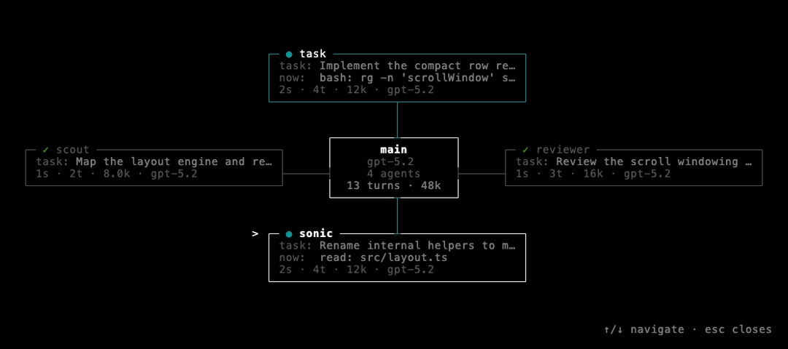
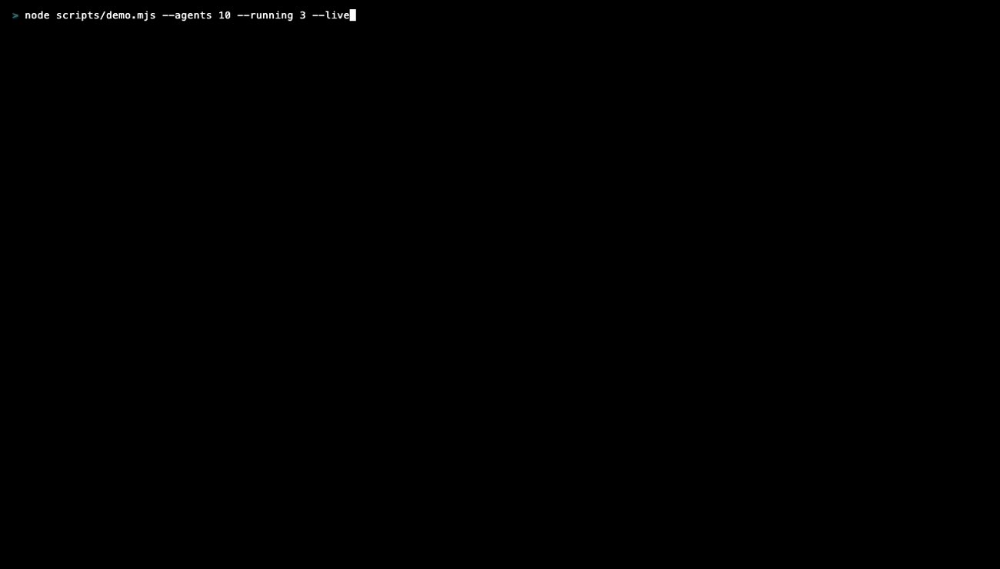

# visual-orchestra

A live, zero-token subagent board for [pi](https://github.com/earendil-works/pi).

The main session as a hub (model included), one node per subagent: state,
assignment, live activity, turns, tokens, model, elapsed. Pure event
observation — no model calls, nothing added to context, the command that
opens it never enters the transcript.



## Install

```sh
git clone https://github.com/ankitsxchdeva/visual-orchestra ~/Documents/visual-orchestra
ln -sfn ~/Documents/visual-orchestra ~/.pi/agent/extensions/visual-orchestra
ln -sfn ~/Documents/visual-orchestra/task.ts ~/.pi/agent/extensions/task.ts
```

Restart pi. The last line installs the bundled streaming `task` tool — skip
it if you already have one (see below).

## Usage

- `/orchestra` or `ctrl+alt+o`: open the board (idle or mid-turn; interactive mode only)
- running nodes always show their assignment (`task:`) and live activity (`now:`)
- `↑`/`↓` or `j`/`k`: move the selection; the selected row wraps its assignment across two lines
- `esc`, `q`, or `ctrl+c`: close

Layout adapts: radial for up to 4 agents when it fits, horizontal fan beyond
that, vertical on narrow terminals. Nodes fill the available width and slack
vertical space spreads the branches. Finished agents collapse to one-line rows
so a long history stays readable; when the list overflows the screen the fan
and vertical layouts scroll with the selection, with `↑ N older` / `↓ N newer`
markers at the hidden ends.



## How it works

Tracks `tool_execution_start` / `tool_execution_update` / `tool_execution_end`
for the `task` tool, keyed by `toolCallId`. Live activity requires a task tool
that streams `onUpdate` partials with details
`{ agent, activity, turns, tokens, model }` — the bundled `task.ts` does this
at zero token cost. It spawns `pi` subprocesses (so `pi` must be on PATH) and
reads agent personas from `~/.pi/agent/agents/*.md`, falling back to a generic
worker. Without streaming partials the board degrades gracefully: agent,
assignment, state, elapsed.

Set `PI_ORCHESTRA_TOOL` to watch a different tool name.

## Requirements

- pi 0.52.10 or newer (needs the `tool_execution_update` extension event; tested on 1.0.0)
- A `task` tool for anything to appear on the board

## Development

- `node --test test/` — regression suite (settlement logic in `task.ts`, scroll-window math in `windowing.ts`)
- `node scripts/demo.mjs --agents 10 --running 3 --keys up,up` — render the board once with synthetic events, no model calls
- `vhs scripts/radial.tape && vhs scripts/fan.tape` — regenerate the README GIFs (needs [VHS](https://github.com/charmbracelet/vhs); drives `demo.mjs --live`, which streams a scripted event timeline and answers stdin keys)
