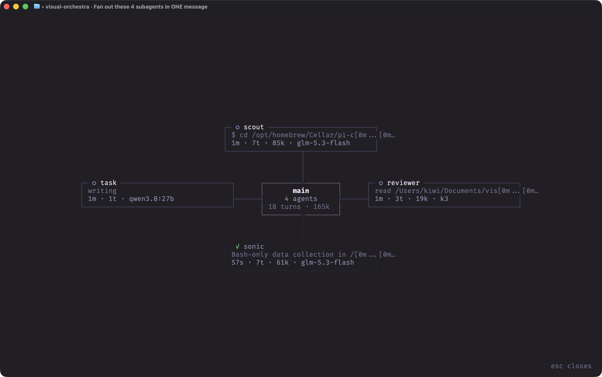
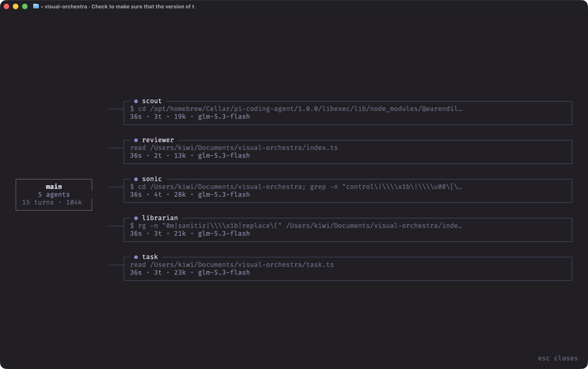
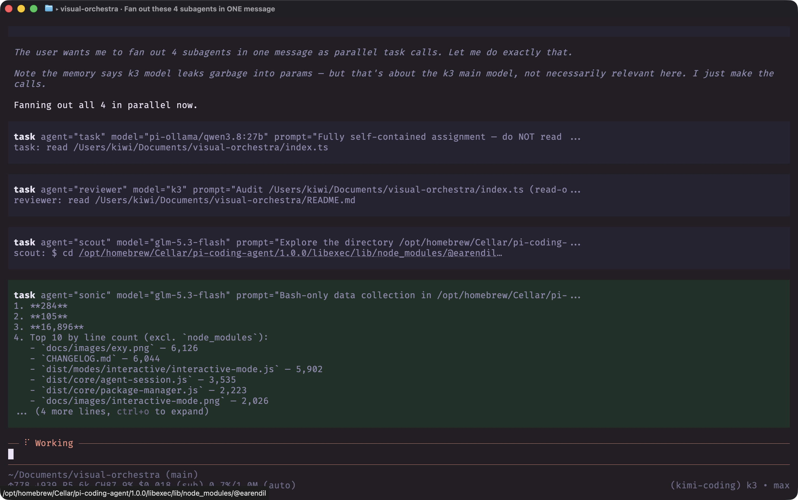

# visual-orchestra

A live, zero-token subagent board for [pi](https://github.com/earendil-works/pi).

The main session as a hub, one node per subagent: state, live activity, turns,
tokens, model, elapsed. Pure event observation — no model calls, nothing added
to context, the command that opens it never enters the transcript.



## Install

```sh
git clone https://github.com/ankitsxchdeva/visual-orchestra ~/Documents/visual-orchestra
ln -sfn ~/Documents/visual-orchestra ~/.pi/agent/extensions/visual-orchestra
ln -sfn ~/Documents/visual-orchestra/task.ts ~/.pi/agent/extensions/task.ts
```

Restart pi. The third symlink is the bundled streaming `task` tool — skip it if
you already have one (see below).

## Usage

- `/orchestra` or `ctrl+alt+o`: open the board (idle or mid-turn)
- `esc` or `q`: close

Layout adapts: radial for up to 4 agents, horizontal fan beyond that, vertical
on narrow terminals.





## How it works

Tracks `tool_execution_start` / `tool_execution_update` / `tool_execution_end`
for the `task` tool, keyed by `toolCallId`. Live activity requires a task tool
that streams `onUpdate` partials with details
`{ agent, activity, turns, tokens, model }` — the bundled `task.ts` does this
at zero token cost. Without it the board degrades gracefully: agent,
assignment, state, elapsed.

Set `PI_ORCHESTRA_TOOL` to watch a different tool name.

## Requirements

- pi 0.87.1 or newer (needs the `tool_execution_update` extension event)
- A `task` tool for anything to appear on the board
